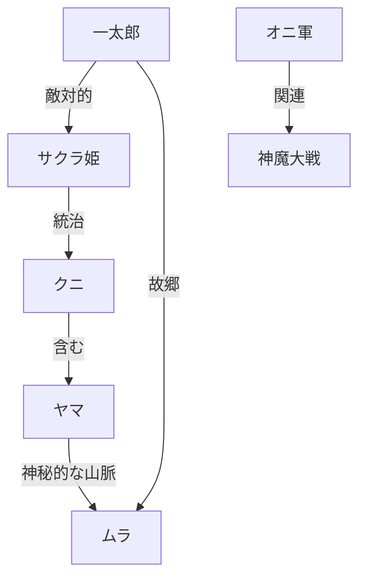

# 関係図

```mermaid
graph TD
    A[一太郎] -->|敵対的| B[サクラ姫]
    B -->|統治| C[クニ]
    A -->|故郷| D[ムラ]
    C -->|含む| E[ヤマ]
    E -->|神秘的な山脈| D
    F[オニ軍] -->|関連| G[神魔大戦]

    click A "../characters/ichitaroh.md" "一太郎の詳細"
    click B "../characters/sakurahime.md" "サクラ姫の詳細"
    click C "../world/kuni.md" "クニの詳細"
    click D "../world/mura.md" "ムラの詳細"
    click E "../world/yama.md" "ヤマの詳細"
    click F "../organizations/onigun.md" "オニ軍の詳細"
    click G "../events/shinmataisen.md" "神魔大戦の詳細"
```

---
[トップページ](../index.md)