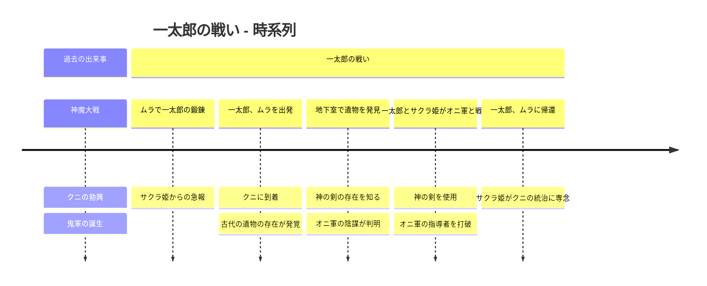

# 時系列

```mermaid
timeline
    title 一太郎の戦い - 時系列
    section 過去の出来事
    神魔大戦 : クニの勃興 : 鬼軍の誕生
    
    section 一太郎の戦い
    ムラで一太郎の鍛錬 : サクラ姫からの急報
    一太郎、ムラを出発 : クニに到着 : 古代の遺物の存在が発覚
    地下室で遺物を発見 : 神の剣の存在を知る : オニ軍の陰謀が判明
    一太郎とサクラ姫がオニ軍と戦う : 神の剣を使用 : オニ軍の指導者を打破
    一太郎、ムラに帰還 : サクラ姫がクニの統治に専念
```